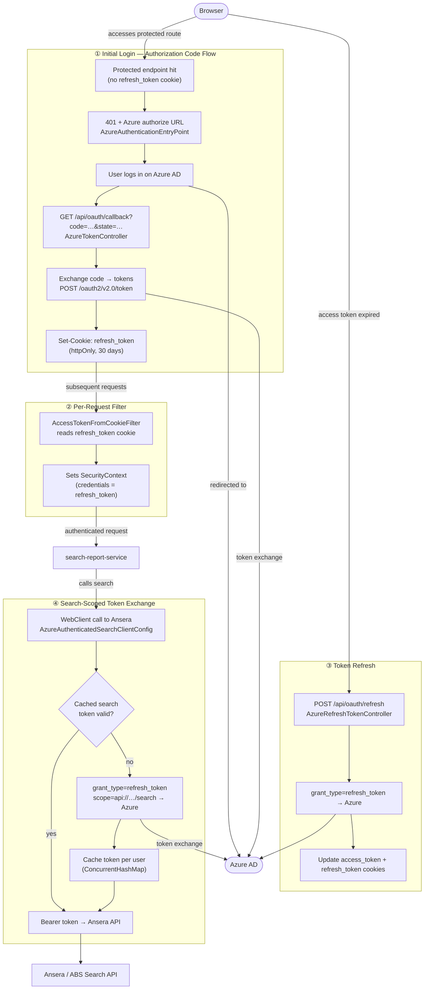

# Azure OAuth Flow — ABS Search Integration

## Overview

When `plugin.identity.provider=azure` is set, the service uses a cookie-based OAuth 2.0 Authorization Code flow to authenticate users against Azure AD and obtain tokens for calling the Ansera (ABS) search API.



### Key classes

| Class | Role |
|---|---|
| `AzureAuthenticationEntryPoint` | Returns 401 + Azure authorize URL when no cookie is present |
| `OAuthStateEncoder` | Encodes `{redirectUrl, timestamp}` as Base64 state param (10 min TTL, CSRF protection) |
| `AzureTokenController` | Handles `/api/oauth/callback` — exchanges auth code, stores `refresh_token` cookie |
| `AzureRefreshTokenController` | Handles `POST /api/oauth/refresh` — rotates `access_token` + `refresh_token` cookies |
| `AccessTokenFromCookieFilter` | Reads cookies per request, populates Spring `SecurityContext` (stateless, no session) |
| `AzureAuthenticatedSearchClientConfig` | WebClient filter that exchanges `refresh_token` for a search-scoped token before each Ansera call |
| `SearchTokenManager` | Optional: exchanges refresh token for search-scoped token and caches it in a `search_token` cookie |

### Configuration Properties

| Property | Description |
|---|---|
| `plugin.identity.provider=azure` | Activates all Azure beans |
| `openid.issuer-uri` | Azure AD tenant URL (`https://login.microsoftonline.com/{tenant}/v2.0`) |
| `openid.client-id` / `openid.client-secret` | App registration credentials |
| `openid.scopes` | Default: `openid offline_access email` |
| `openid.redirect-uri` | Default: `/api/oauth/callback` |
| `openid.search-scope` | Scope for Ansera token exchange, default: `api://b16225bd-…/search` |
| `integration-endpoints.authenticated-search-service` | Ansera/ABS base URL |
| `azure.search.scope-exchange.*` | Optional cookie-based search token caching (`SearchTokenManager`) |

---

# How to run
```
chmod +x run.sh
./run.sh GH_ACCOUNT GH_ACCESS_TOKEN


#Monitor
docker logs -f search-report-service


```

# Logging
For more logging options use following variables 
```
    root: ${ROOT_LOGGING_LEVEL:WARN}
    org.epo.itc: ${APP_LOGGING_LEVEL:INFO}
    org.springframework: ${SPRING_LOGGING_LEVEL:WARN}
    org.hibernate.SQL: ${SQL_LOGGING_LEVEL:WARN}
```
